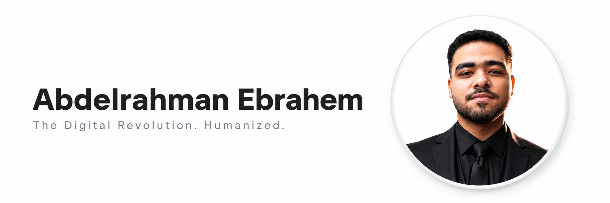

<!-- HEADER BANNER WITH ROBUST ALT TEXT -->

  

<h1 align="center"> Abdelrahman Ebrahem Rabie El Shafie </h1><!-- -->

  <strong>"The Digital Revolution. Humanized."</strong><!-- -->

  
  
   <!-- -->

---

## 👤 Executive Biography

I am a highly driven **Front-End Developer**, **UI/UX Web Architect**, and **EdTech Solutions Specialist** based in Cairo, Egypt.<!-- --> Currently majoring in **Educational Technology** at the Faculty of Specific Education, **Ain Shams University**.<!-- --> 

My academic foundation in EdTech provides me with deep cognitive insights into how users absorb information.<!-- --> I leverage this unique expertise alongside modern web engineering to build highly interactive, accessible, and fast web applications that don't just function—they educate and engage.

### 🌟 Leadership & Strategic Directives
My development methodology is deeply integrated with agile collaboration and leadership dynamics.<!-- --> I actively serve as the **Vice President** for the student organization **نادي الابتكار وريادة الأعمال (I-CLUB)**.<!-- --> I apply modern project management standards to every application I design, bridging the gap between educational psychology and robust front-end architecture.<!-- -->

---

## 🛠️ Technical Armament & Stack

### 💻 Languages & Core Stack

   <!-- -->
   <!-- -->
   <!-- -->
   <!-- -->
   <!-- -->

### 🔌 AI Integration & APIs (Engineered APIs)

  
  
  

### 🖥️ AI-Augmented IDEs & Development Environments
*I actively leverage advanced AI-powered environments and developer systems to maximize coding productivity, maintain code quality, and speed up delivery pipelines:*

  
  
  
  
  

### 🗄️ Backend, Databases & Client State

   <!-- -->
   <!-- -->
  

---

## 🚀 Architectural Project Registry

### 📁 Core Production Platforms

#### 🎓 Sit El-Kol Platform (`set-el-kol.vercel.app`) <!-- -->
> An integrated, multi-semester learning management system and exam simulator. <!-- -->
*   **Architecture:** Formulated with real-time Firebase Authentication, Cloud Firestore database instances, and client-side password-protected admin control panels. <!-- -->
*   **UX Innovation:** Features dynamic adaptation mechanics where the entire user interface and resource tracking automatically adjust based on the active university term. <!-- -->

#### 📖 Sokna Platform (سُكنى للقرآن الكريم)
> A dedicated, highly accessible digital space for reading, listening, and studying the Holy Qur'an.
*   **Architecture:** Formulated with lightweight audio stream rendering, fast client-side structural search queries, and optimized mobile-first reading viewports to guarantee complete visual comfort.

#### 🧪 T3lemk Platform (`t3lemk.vercel.app`) <!-- -->
> A comprehensive EdTech application structured specifically for middle school curriculums. <!-- -->
*   **Impact:** Engineered utilizing modular ES6+ JavaScript and secured via server-side Firestore rules on Vercel. <!-- -->

#### 💰 Felosak Fein (`expenses-tracker-beta-plum.vercel.app`) <!-- -->
> An interactive daily expense planner and budget distribution tracker. <!-- -->
*   **Architecture:** Integrated directly with Firebase database systems, enabling personalized user financial planning and active salary planning tools. <!-- -->

#### 🤖 ProfileReady (`profile-ready.vercel.app`) <!-- -->
> An AI-powered SaaS builder optimized for compiling dynamic, ATS-friendly professional resumes. <!-- -->
*   **Architecture:** Powered by Grok API. Seamlessly maps user data into highly structural CV models designed to maximize passing scores in automated recruitment algorithms. <!-- -->

#### 🌐 Live Portfolio Hub (`portfolio-nu-nine-71.vercel.app`) <!-- -->
> The production-grade engine powering this very showcase. <!-- -->
*   **Architecture:** Multi-theme personal portfolio website designed to showcase operational production platforms and optimized asset delivery pipelines. <!-- -->

---

### 📚 Academic EdTech Summaries & Applications
*Lightweight, highly optimized revision tools built to deliver rapid academic summaries, visual code sheets, and dynamic testing banks for university courses:*

*   **🎨 Graphic Design Summary:** A highly structured interactive companion compiling graphic design principles, complete with an instant revision question bank.
*   **💻 Programming Intro Summary:** A modular, quick-reference repository detailing introductory programming concepts alongside core executable code blocks.
*   **🔌 OS (Operating Systems) Summary:** Simplifies complex architectural processes (processes, memory allocation) with interactive flowcharts and maps.
*   **🎙️ Broadcasting Q-Bank:** A real-time test simulator designed for exam preparation, featuring custom score submissions and comprehensive answer sheets.
*   **📁 Office Apps Summary:** A robust guide accompanied by an interactive 300+ question bank built to test Microsoft Office suite skills.
*   **📊 Nexus Dashboard:** An interactive data visualization hub designed to test and refine dashboard analytical structures.
*   **👤 Avatar Project:** A performance-driven interactive UI showcasing fluid responsive navigation bars across tight screen breakpoints.
*   **💈 Al-Ostaz Salon:** A modern, visual service-showcase page designed to present catalog pricing and service structures.
*   **👟 Adidas Landing Page:** A modern e-commerce conceptual landing page utilizing responsive CSS and clean interaction states.
*   **✨ Creative Layers:** An experimental design studying advanced depth manipulation using multi-layered visual overlays.

---

## 📈 Professional Milestones & Experience

### 💼 Freelance Front-End & EdTech Developer <!-- -->
*   Successfully engineered and delivered custom EdTech web platforms with an exceptional focus on user accessibility.
*   Built and maintained Firebase-driven applications with a high focus on performance optimization and asset delivery. <!-- -->
*   Accelerated client-side platform delivery times by instituting Agile development processes and precise front-end architectural standards.

### 👔 Vice President — ASU Innovation & Entrepreneurship Club (I-CLUB) <!-- -->
*   Direct and manage structural coordination, communication workflows, and technical skill development pipelines for student startup incubator cohorts. <!-- -->

---

## 📜 Professional Certifications

*   🏆 **McKinsey & Company Leadership Certificate**
*   🗣️ **Communication Skills Certificate**
*   🧠 **Self Knowledge Certificate**
*   🎨 **Complete CSS Language Certificate**
*   💼 **How to be an HR Specialist Certificate** <!-- -->
*   📈 **Digital Marketing Certificate**
*   🏢 **Training of Trainers (TOT) Certification** <!-- -->
*   💻 **CIT (Certificate of Information Technology)**
*   🤖 **Design & Profit with AI Certificates**
*   📜 **JavaScript Language Certificate**
*   💾 **ICDL Certification**
*   🤝 **Sign Language Communication Certification**

---

## 🗣️ Languages

*   🇸🇦 **Arabic:** Native or Bilingual Proficiency
*   🇺🇸 **English:** Full Professional Proficiency

---

## 📬 Initiate Connection

All primary communication nodes, active social feeds, creative graphics portfolios, and project portals are integrated into a single, highly accessible gate. Let's engineer the future:

👉 **[Access the Unified Linktree Gateway](https://linktr.ee/AbdelrahmanEbrahem)**

---

  <i>Abdelrahman Ebrahem © 2026 | The Digital Revolution. Humanized.</i>

